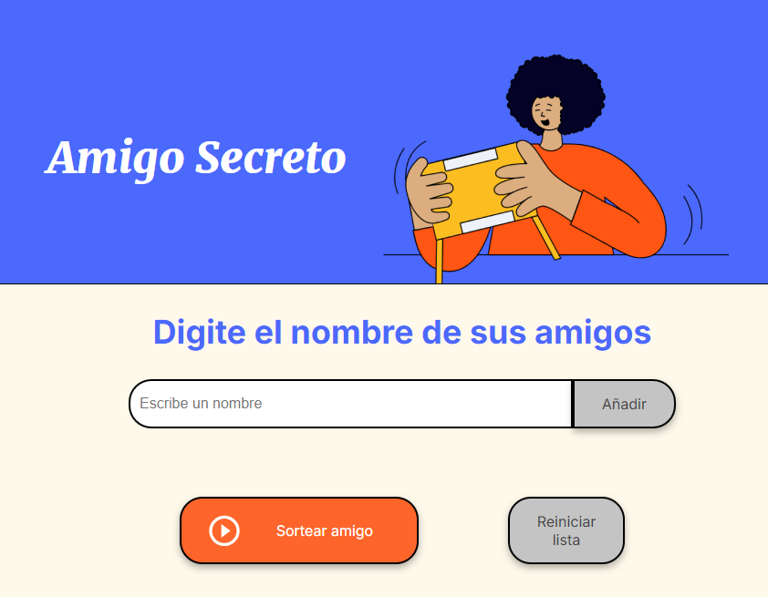
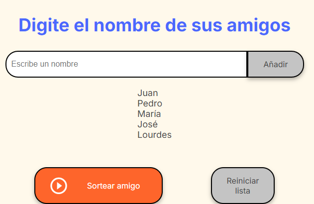
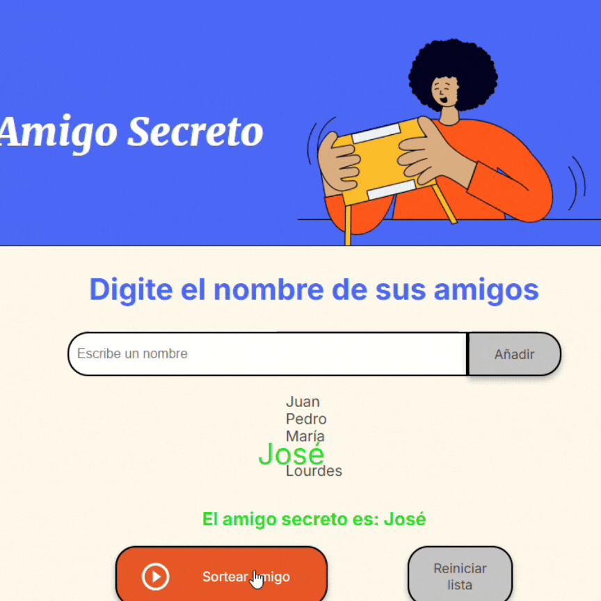
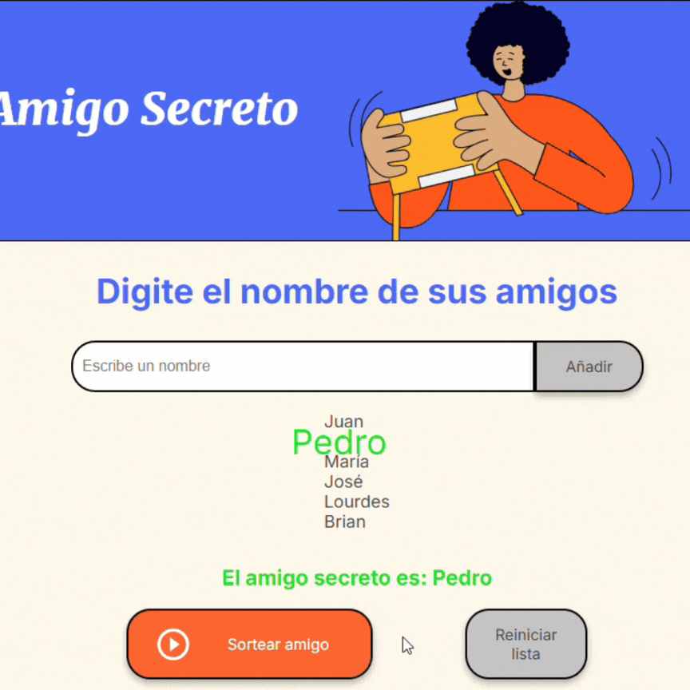

# Amigo Secreto

¡Bienvenido a **Amigo Secreto**! Este proyecto permite realizar sorteos aleatorios para elegir un "amigo secreto" o ganador de manera fácil y rápida. Ideal para reuniones, celebraciones o cualquier actividad que requiera elegir al azar.

---

## Características

- **Agregar nombres**: Los usuarios pueden ingresar nombres mediante un campo de texto y un botón "Adicionar".
- **Lista visible**: Los nombres ingresados se muestran en una lista en pantalla.
- **Evitar campos vacíos**: No se permite agregar nombres vacíos.
- **Evitar nombres repetidos: No se permite agregar dos nombres iguales.
- **Sorteo aleatorio**: Un botón "Sortear Amigo" selecciona y destaca un nombre al azar.
- **Reiniciar juego**: Un botón "Reiniciar" permite limpiar la lista y comenzar nuevamente.
- **Responsive**: Funciona perfectamente en cualquier dispositivo con navegador.

---

## Tecnologías

Este proyecto está desarrollado con las siguientes tecnologías:

- **HTML**: Estructura del proyecto.
- **CSS**: Estilo y diseño responsivo.
- **JavaScript**: Lógica para la funcionalidad del sorteo y la interacción.

No requiere dependencias ni entornos adicionales. Simplemente ábrelo en tu navegador favorito y listo.

---

## Uso

### Paso a Paso

1. **Abrir el proyecto**:
   - Descarga el proyecto o clona el repositorio.
   - Abre el archivo `index.html` en tu navegador.

2. **Agregar nombres**:
   - Escribe un nombre en el campo de texto.
   - Haz clic en el botón "Adicionar" para añadirlo a la lista visible.

3. **Sortear un amigo**:
   - Una vez que hayas ingresado todos los nombres deseados, haz clic en "Sortear Amigo".
   - El nombre del ganador será destacado.

4. **Reiniciar el juego**:
   - Haz clic en el botón "Reiniciar" para limpiar la lista y comenzar desde cero.

5. **Volver a sortear**:
   - Luego de cada sorteo, la lista de nombres se elimina, dejando en pantalla el ganador anterior, el cual se eliminará cuando se genere uno nuevo.

---

## Contribuciones

Este es un proyecto de **código abierto**. Si deseas contribuir con sugerencias o mejoras, ¡eres más que bienvenido! Puedes enviar un pull request o contactarme directamente.

---

## Autor

**Brian Ruiz Moreno**

- Portafolio: [brianruizmoreno.github.io/Portfolio](https://brianruizmoreno.github.io/Portfolio/)
- ¡Contáctame para más información o para colaborar juntos!

---

## Información Adicional

- Captura inicial mostrando el campo de texto y los botones "Adicionar" y "Sortear Amigo".

- Captura de una lista visible con nombres ingresados.

- Una demostración del ganador destacado tras hacer clic en "Sortear Amigo".

- Una vista del estado inicial tras presionar "Reiniciar" y mensaje de error al querer sortear sin nombres.

¡Gracias por usar **Amigo Secreto**! 🎉

